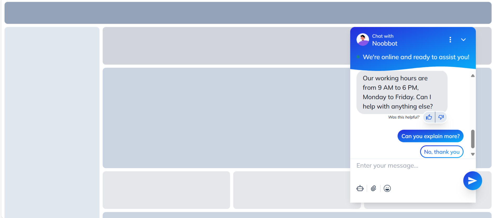
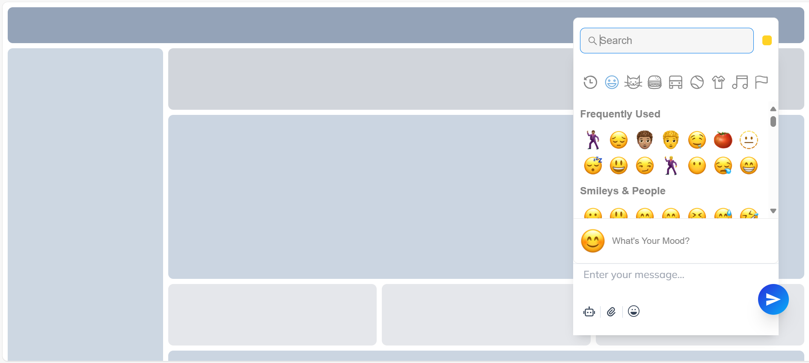
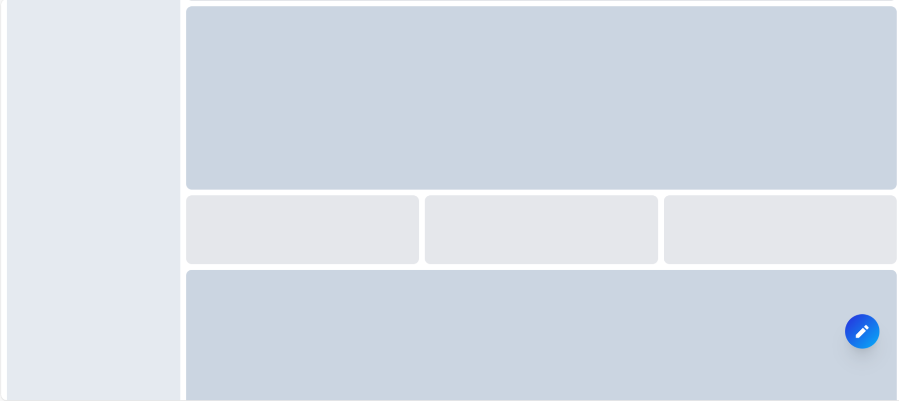

# Chatbot Frontend

This project is a modern, responsive chatbot frontend built with React, TypeScript, and Tailwind CSS. It provides an interactive chat interface with predefined conversation flows and quick action buttons.

## Features

- Interactive chat interface
- Predefined conversation flows
- Quick action buttons for user responses
- Rating system for certain chat steps
- Responsive design using Tailwind CSS
- Built with React and TypeScript for type safety

## Project Structure

- `src/components/chatbot/ChatBox.tsx`: Main chatbot component
- `src/components/chatbot/chatFlow.ts`: Defines the conversation flow and chat steps
- `src/lib/utils.ts`: Utility functions for className merging
- `src/components/skeleton.tsx`: Skeleton component for loading states


## Screenshots





## Setup and Installation

1. Clone the repository:

```bash
git clone https://github.com/jainnhimanshuu/chatbot-frontend.git
```

2. Navigate to the project directory:

```bash
cd chatbot-frontend
```

3. Install dependencies:

```bash
npm install
```

4. Start the development server:

```bash
npm run dev
```

5. Open your browser and visit `http://localhost:5173` to see the chatbot in action.
